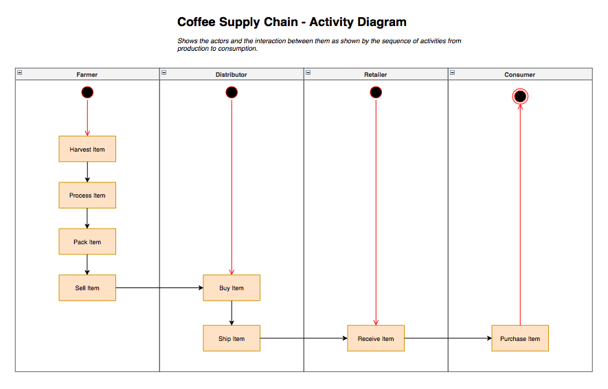
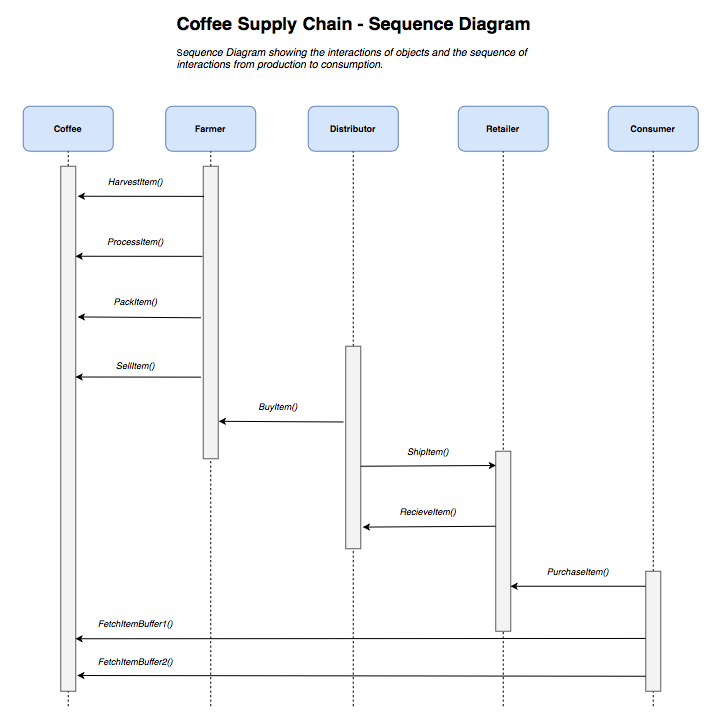
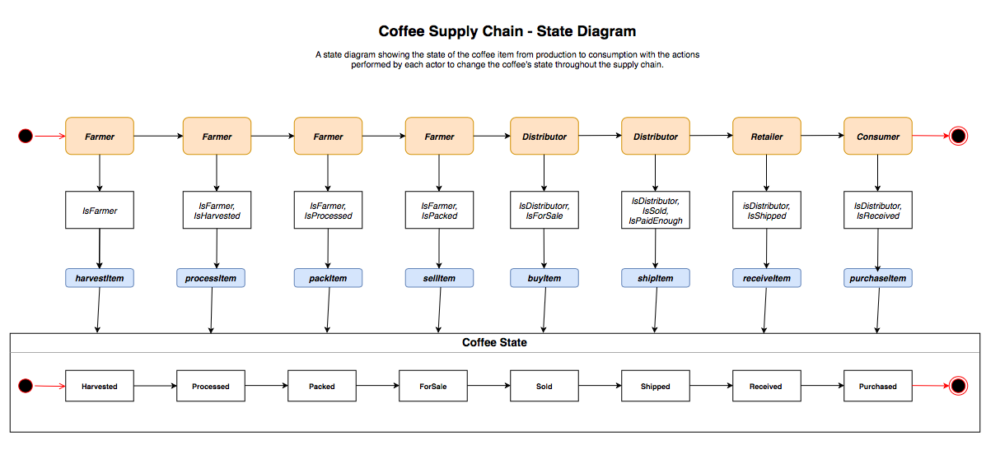
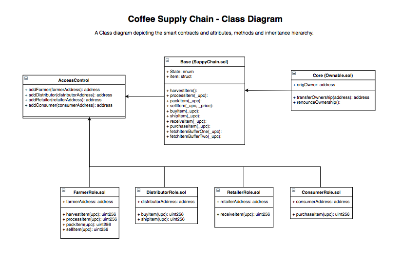

# Supply Chain DApp

## Description
This repository contains the source code for an Ethereum Supply Chain DApp which aims to demonstrate how a traditional supply chain can be conducted on the blockchain to track and verify the items journey from producer to consumer. The scenario presented here is a coffee supply chain.

### Actors & Actions

* Farmer - Harvests, processes, packs and lists coffee beans for sale.
* Distributor - Purchases coffee beans from farmer and ships coffee bean to retailer.
* Retailer - Receives coffee beans from distributor.
* Consumer - Buys coffee beans from retailer.

The coffee supply chain is outlined in the projects UML diagrams presented below.

## UML Diagrams






## Rinkeby Contract Addresses

* FarmerRole - 0x2EcC21768A4430Cd690f749C60631EbFb49F9401
* DistributorRole - 0x18edC57cdD06f0ED4f42eC3CA9E2615C4E4Fdc6F
* RetailerRole - 0x207b8bEf87e9fe8D1c3acF240125ED75d1df36Dd
* ConsumerRole - 0xF385C48680A1896217F1Ef17bB06CC4866Ed7870
* SupplyChain - 0x687d9d7DC3d6FEc175E815105a55B5510ADc6d56

## DApp User Interface

The DApp User Interface when running should look like...


## Transaction History

* Harvested - 0xa0228d11df3192ed3c92c7f1b54df2fcec0d04a37866a66a9eaf4ad6acd28d66
* Processed - 0x3b55f8d8373ba59b2de96495fc04fa9ffa8aa8608630a560142182c0c835e429
* Packed - 0x63cb7529423727c2280b56ffa749b119d3d43c00b2a3e48f891f94dc9e64c125
* ForSale - 0xe86cb7fdd15d7a118c59d6a2d8396d22fd9675fb6cb17988a07e423526949ef6
* Sold - 0xd101bcf0119f14931db4d1de3867450c3a52e749bd1ad9667aac50a334f1bd06
* Shipped - 0x909305be1cd6710cb2d802aad013f43b9297f9e39b2ab79d02562fa144dba941
* Received - 0xbc62c7da1c28a639578e2c4a25e38cc27cac03052e77e4339846c02cbae69622
* Purchased - 0xc11ae38c2a770eeb705cabaa420ce0e444edbf4236c081ab1742771bb9add480

### Prerequisites

* Truffle: v5.1.1 (core: 5.1.1)
* Node: v11.15.0
* Web3.js: v1.2.2
* Programme version: v1.0

## How to Setup

A step by step series of examples that tell you have to get a development env running

Clone this repository:

```
git clone https://github.com/Brad-Behrens/Supply-Chain-DApp.git
```

Change directory to ```project-6``` folder and install all requisite npm packages (as listed in ```package.json```):

```
cd Supply-Chain-DApp
npm install
```

Launch Ganache:

```
ganache-cli -m "spirit supply whale amount human item harsh scare congress discover talent hamster"
```

Your terminal should look something like this:


In a separate terminal window, Compile smart contracts:

```
truffle compile
```

Your terminal should look something like this:


This will create the smart contract artifacts in folder ```build\contracts```.

Migrate smart contracts to the locally running blockchain, ganache-cli:

```
truffle migrate
```

Your terminal should look something like this:


Test smart contracts:

```
truffle test
```

All 10 tests should pass.


In a separate terminal window, launch the DApp:

```
npm run dev
```

## Built With

* [Ethereum](https://www.ethereum.org/) - Ethereum is a decentralized platform that runs smart contracts
* [IPFS](https://ipfs.io/) - IPFS is the Distributed Web | A peer-to-peer hypermedia protocol
to make the web faster, safer, and more open.
* [Truffle Framework](http://truffleframework.com/) - Truffle is the most popular development framework for Ethereum with a mission to make your life a whole lot easier.


## Acknowledgments

* Solidity
* Ganache-cli
* Truffle
* IPFS
